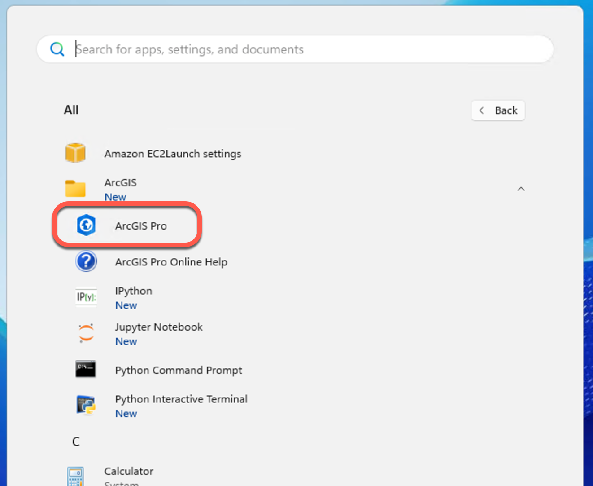
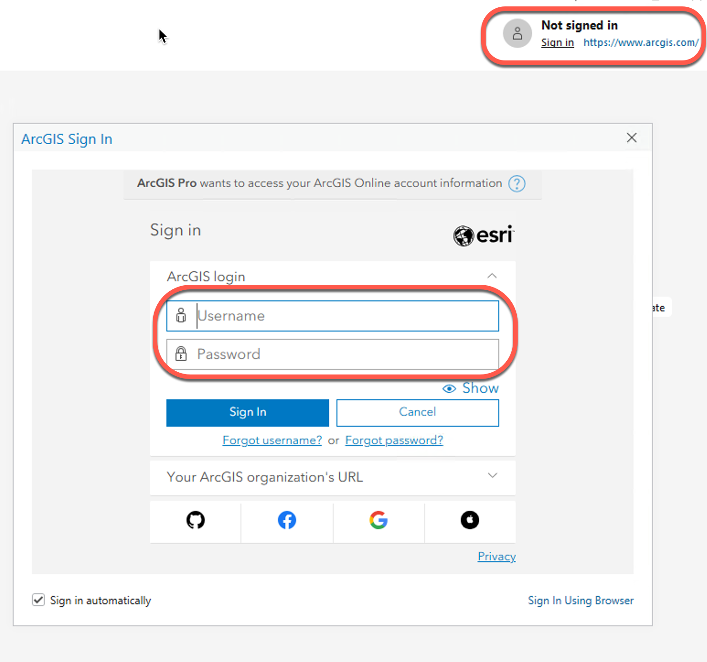
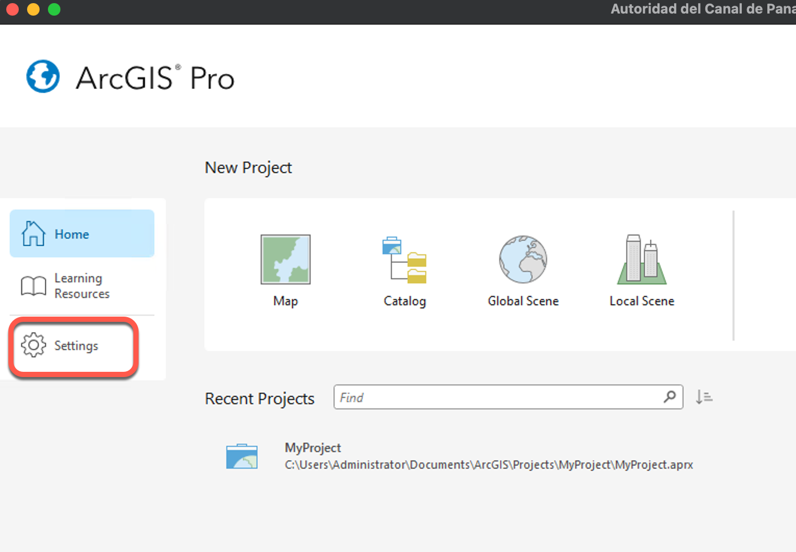
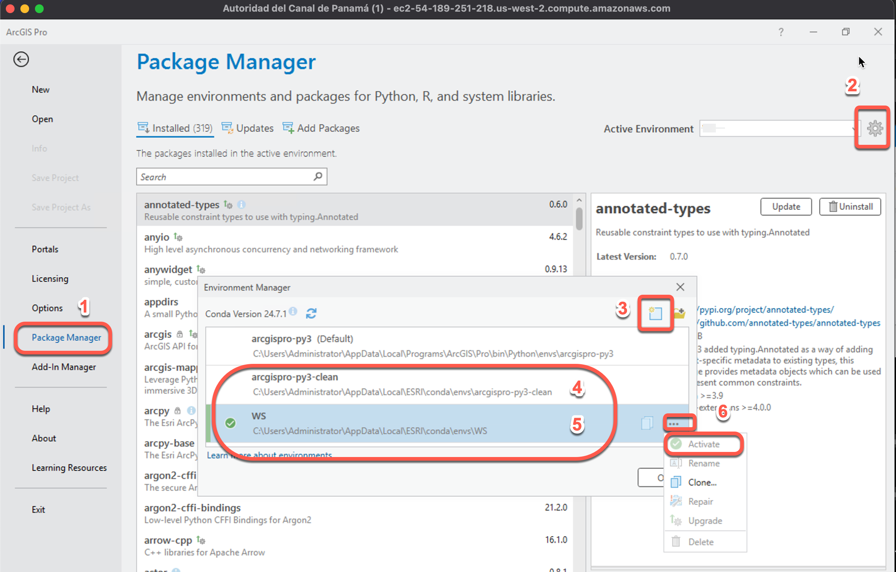
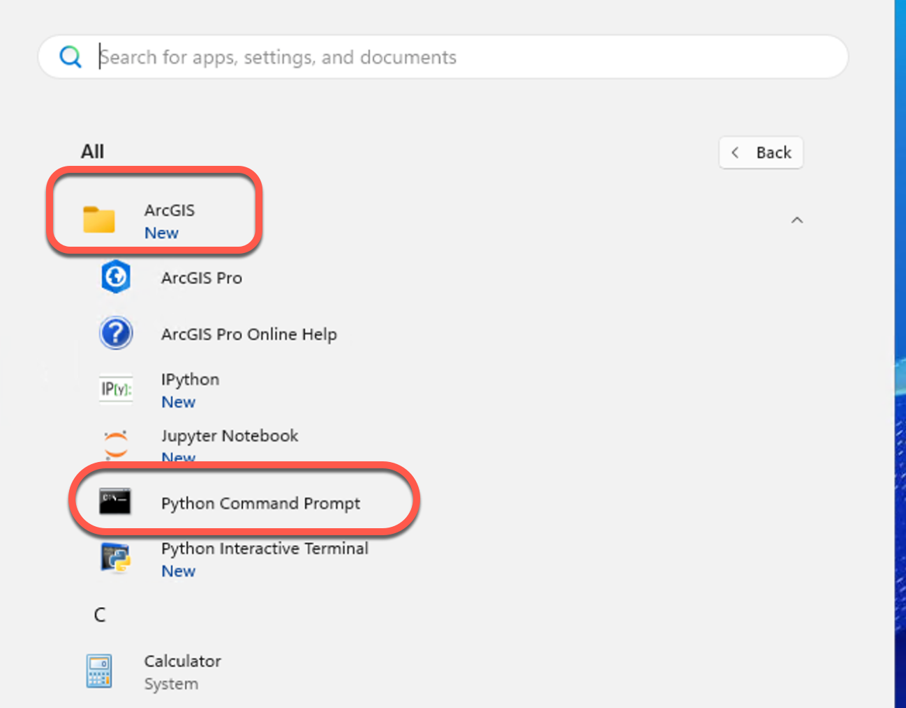
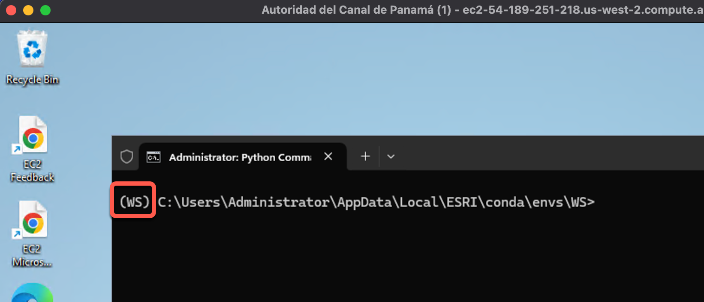

# Installation Steps

### 0. Install [Notepad++](https://notepad-plus-plus.org/) and [7-Zip](https://www.7-zip.org/)

### 1. Start ArcGIS Pro



### 2. Login withyour ArcGIS Online account listed in Excel Spreadsheet.



### 3. Go to `Settings` -> `Package Manager`



Click on the `Gear Icon`. Select `arcigspro-py3 (Default)` and clone it with a new name:

`C:\Users\Administrator\AppData\Local\ESRI\conda\envs\arcgispro-py3-clean`

Repeat the last step with a new name:

`C:\Users\Administrator\AppData\Local\ESRI\conda\envs\WS`

Click the `...` button in the `WS` environment and select `Activate`.



### 6. Open `Python Command Prompt` from `Start` -> `All` -> `ArcGIS` -> `Python Command Prompt`.



### Make sure the WS conda environment is active



## Install python packages

```bash
conda install -c conda-forge openjdk=8.0.412 --yes
pip install pyspark==3.5.5
conda install -c conda-forge babel --yes
conda install geopandas --yes
conda install -c conda-forge pandas pytz --force-reinstall 
```

## Hadoop Setup

1. Download Hadoop binaries from:
   [https://github.com/cdarlint/winutils](https://github.com/cdarlint/winutils)

2. Steps:
    - Download the ZIP file
    - Unzip it
    - Copy the `Hadoop-3.3.6` folder to `C:\`
    - Rename it to `Hadoop`


## Download the content to `C:\`.

- from [ACP Workshop](https://esriis-my.sharepoint.com/my?login_hint=kyun4731%40esri%2Ecom&source=waffle)
- Copy `input` folder to `C:\input`
- Copy `WS` folder to `C:\WS`
